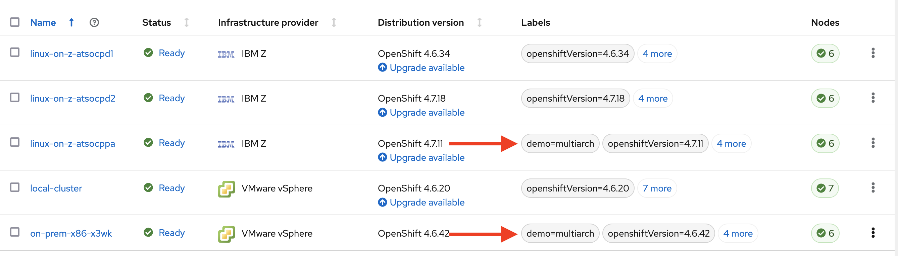

# Building a Multiarchitecture Container Image and Deploying on IBM Z and x86 with Red Hat Advanced Cluster Management

<mark>You can find a video of this demonstration here: <mark>

## Tools Used

1. Red Hat Advanced Cluster Management (RHACM)
1. OpenShift Container Platform on x86 and IBM Z
1. GitHub
1. Quay.io Container Registry
1. buildah
1. podman

## Goal of Demonstration

The goal of this demo is to show how one can build a multiarchitecture container image that supports both IBM Z and x86 architectures from a container image originally built just for x86. We will then use RHACM to deploy this multiarchitecture container image to OpenShift clusters of each architectures at the same time.

## Demo Steps

### Explore RHACM

Red Hat Advanced Cluster Management provides end-to-end management visibility and control to manage Kubernetes environments such as Red Hat OpenShift. With RHACM, you can manage & create clusters along with the applications running on them whether the clusters are on premesis, in the public cloud, or built on different architectures.

RHACM is a containerized application deployed as an operator on an OpenShift cluster, known as the Hub cluster. RHACM and this Hub cluster can then have visibility into other Kubernetes clusters known as Managed clusters.

With a solution like RHACM managing multiple clusters of various architectures, a common concern is that an application might run on one cluster, but not on another depending on how the container image was built. This is a common scenario due to a variety of reasons, such as bringing in a new architecture cluster into an overarching hybrid cloud environment, or simply because developers develop on the systems they are used to and have available.

In this demo, we are using a RHACM Hub cluster that is running on x86 on-premises and managing-to four managed clusters - three on IBM Z, and one on x86 cluster. Note that in the picture below, the local managed cluster counts as one of the clusters in the overview.


On the RHACM overview page, we are provied with details about all of the clusters RHAM is managing including the health and status of each cluster, and the quantity of applications, pods, etc that RHACM has access to.

*Note: "Applications" has a specific meaning in the context of RHACM. An Application is a Kubernetes resource that will be created on the Hub cluster when we deploy an Application to the managed clusters. We will talk more about this later in the demo.*

If we look at the Infrastructure / Clusters tab, all of our managed clusters will be listed, along with our Hub cluster (displayed as local-cluster in the screenshot below).


As mentioned earlier, you can see that we are managing various OpenShift clusters on IBM Z and VMware vSphere.

RHACM can not only provide visibility into your hybrid cloud ecosystem of Kubernetes clusters, it can also deploy and manage applications across all of them from a single pane of glass. we will move on to the next section to do so.

### Deploy  Initial Application from RHACM

In a hybrid cloud environment with multiple clusters like this one, there are scenarious where an organization might want to deploy an application to a few of their clusters, but not necessarily all of them. Organizations might have tens, hundreds, or even thousands of Kubernetes clusters in different regions & datacenters, for different teams, or split up by dev/test/QA/production. Whatever the case, we need a mechanism to pick and choose which clusters to deploy an Application to. With RHACM, this is done by using **labels**.

1. From our RHACM Clusters page, we will add labels to two of our clusters - one on IBM Z, and one on VMware vSphere.

    Click on the three dots on the far right of the cluster then selecting edit labels:

    

    In the text box, type `demo=multiarch`, press `enter`, and then click `Save`. 

    

    We'll repeat this step for another cluster of a different architecture.

    

    With matching labels applied to two of our managed clusters, we can now create an Application and dictate which clusters to deploy to.

1. In the RHACM Console, we navigate to the Applications page from the left-side menu, then click on the `Create Application` button.

    

    On the new page, we will enter the following details about our Application. Our app will be a browser-based video game written in Spring Boot and Phaser where you shoot Kubernetes objects that appear. This is an interesting sample application because if you successfully shoot the Kubernetes objects, they will actually be deleted off of your managed OpenShift cluster (don't worry - your application pods will automatically regenerate thanks to Kubernetes).

    The source repo for our sample application is here: <https://github.com/gshipley/wild-west-kubernetes>.

    On the application creation page, we enter the following parameters:
    * Name: `wildwest-multiarch`
    * Namespace: `wildwest`
    * Repository Type: `Git`
    * URL: <https://github.com/mmondics/wild-west-kubernetes>
    * Deploy application resources only on clusters matching specific labels:
        * Label Name: `demo`
        * Label Value: `multiarch`
    
    *Note: if you're interested, you can toggle the YAML:Off button to `YAML:On to see the components and structure of the application we're creating.*

    Click `Save` in the top right of the page

    We are redirected to a new page for our `wildwest` application, and the Kubernetes / OpenShift components described in `k8s.yaml` are created on the two target clusters. This includes a Deployment, Service, Route, and RoleBinding.

    

    As the objects finish creating, we have some warnings and errors in the Cluster resource status section. This indicates that some of our deployed application components are in error states.

    Scrolling further down this page, we find a Topology diagram for the application we just created.

    

    Our ReplicaSet has errors occuring, which in turn affects the Deployment that owns it. 


### Investigate Application Error on IBM Z Cluster

Show RHACM overview with errors.

Show errors on OCP cluster.

Remove application RHACM.

### Rebuild Container Image as Multi-Architecture

On terminal session, pull x86 container image from quay:

`podman pull quay.io/mmondics/wildwest:v1`

View image with:

`podman images`

Inspect image with:

`podman inspect quay.io/mmondics/wildwest:v1`

Look for architecture and you will see `amd64`

Look at the Dockerfile that was used to build this image, and notice the build image in dockerhub.

`FROM maven:3.6.2-jdk-11 as builder`

Navigate to <https://hub.docker.com/_/maven> and search for the tag `3.6.2-jdk-11`

Notice that the only architecture listed for this tag is `amd64`.

Notice that there is a `3.6.2-jdk-11-openj9` tag that includes `s390x` as one of the architectures, along with `amd64` and `pp64le`. This is a multiarchitecture maven build image that we can use to build a new container image that can run on s390x.

Edit the Dockerfile to use this new tag:

```Dockerfile
FROM maven:3.6.2-jdk-11-openj9 as builder
COPY src /usr/src/app/src
COPY pom.xml /usr/src/app
RUN mvn -f /usr/src/app/pom.xml clean package
FROM adoptopenjdk/openjdk11:latest as runtime
LABEL maintainer="gshipley@vmware.com"
EXPOSE 8080
COPY --from=builder /usr/src/app/target/wildwest-1.0.jar /usr/app/wildwest.jar
ENTRYPOINT ["java","-Djava.security.egd=file:/dev/./urandom","-jar","/usr/app/wildwest.jar"]
```

Create a new container image from this edited Dockerfile:

`buildah build-using-dockerfile  -t quay.io/mmondics/wildwest:v2 .`

Use the image from docker.io

The new image is present and on our local machine. View it with:

`poman images`

Push it to the quay repository so it will be with the amd64 specific image.

`podman push quay.io/mmondics/wildwest:v2`

We now have two separate images in the wildwest quay repository, separated by tags `v1` and `v2`. Remember that `v1` is the `amd64` image, and `v2` is the `s390x` image.

Show both images in quay.io/mmondics/wildwest

Now let's use podman to create a single manifest list that can be used to deploy both versions of the wildwest container image at the same time.

Create a new manifest list with:

`podman manifest create quay.io/mmondics/wildest-multiarch:v1`

Add both container images for `v1` and `v2` to the manifest:

`podman manifest add quay.io/mmondics/wildwest-multiarch:v1 quay.io/mmondics/wildwest:v1`

`podman manifest add quay.io/mmondics/wildwest-multiarch:v1 quay.io/mmondics/wildwest:v2`

View the manifest list with:

`podman manifest inspect quay.io/mmondics/wildwest-multiarch:v1`

And notice the two architectures.

Push the manifest to quay:

`podman manifest push quay.io/mmondics/wildwest-multiarch:v1 quay.io/mmondics/wildwest-multiarch:v1`

Edit the `k8s.yaml` file to use the manifest image instead of the original `amd64` image.

```yaml
    spec:
      terminationGracePeriodSeconds: 0
      containers:
      - name: wildwest
        image: quay.io/mmondics/wildwest-multiarch:v1
        imagePullPolicy: Always
        ports:
        - containerPort: 8080
```

### Re-deploy Application from RHACM with sync

Back in the RHACM console on the application page, click `Sync` and wait for the pods to recreate on `atsocppa`. This will take a minute or two.

### Cleanup
