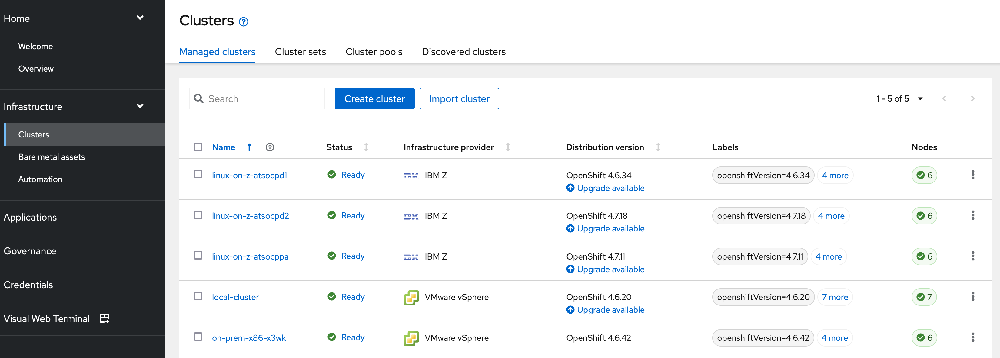

# Building a Multiarchitecture Container Image and Deploying on IBM Z and x86 with Red Hat Advanced Cluster Management

## Tools Used

1. Red Hat Advanced Cluster Management (RHACM)
1. OpenShift Container Platform on x86 and IBM Z
1. GitHub
1. Quay.io Container Registry
1. buildah
1. podman

## Goal of Demonstration

The goal of this demo is to show how one can build a multiarchitecture container image that supports both IBM Z and x86 architectures from a container image originally built for x86 alone. We will then use Red Hat Advanced Cluster Management (RHACM) to deploy this multiarchitecture container image to OpenShift clusters of each architectures at the same time.

## Demo Steps

### Explore Red Hat Advanced Cluster Management

Red Hat Advanced Cluster Management provides end-to-end management visibility and control to manage Kubernetes environments such as Red Hat OpenShift. With RHACM, you can manage & create clusters along with the applications running on them whether the clusters are on premesis, in the public cloud, or built on different architectures.


RHACM is a containerized application deployed as an operator on an OpenShift cluster, known as the Hub cluster. RHACM and this Hub cluster have visibility into, and control of, other Kubernetes clusters known as Managed clusters.

With a solution like RHACM managing multiple clusters of various architectures, a common issue is that an application might run on one cluster, but not on another depending on how the container image was built. This is a common scenario due to a variety of reasons, such as bringing in a new architecture cluster into an overarching hybrid cloud environment, or simply because developers create applications on the systems they are used to and have available.


In this demo, we are using a RHACM Hub cluster that is running on x86 on-premises and managing-to four managed clusters - three on IBM Z, and one on x86. Note that in the picture below, the local managed cluster also shows as a managed cluster in the overview.


On the RHACM overview page, we are provied with details about all of the clusters RHAM is managing including the health and status of each cluster, and the quantity of applications, pods, etc that RHACM has access to.

*Note: "Applications" has a specific meaning in the context of RHACM. An Application is a Kubernetes resource that will be created on the Hub cluster when we deploy an Application to the managed clusters. We will talk more about this later in the demo.*

If we look at the Infrastructure / Clusters tab, all of our managed clusters will be listed, along with our Hub cluster (displayed as local-cluster in the screenshot below).



As mentioned above, you can see that we are managing various OpenShift clusters on IBM Z and VMware vSphere.

RHACM can not only provide visibility into your hybrid cloud ecosystem of Kubernetes clusters, it can also deploy and manage applications across all of them from a single pane of glass.

### Deploy  Initial Application from RHACM

In a hybrid cloud environment with multiple clusters like this one, there are scenarious where an organization might want to deploy an application to a few of their clusters, but not necessarily all of them. Organizations might have tens, hundreds, or even thousands of Kubernetes clusters in different regions & datacenters, for different teams, or split up by dev/test/QA/production. Whatever the case, we need a mechanism to pick and choose which clusters to deploy an Application to. With RHACM, this is done by using **labels**.

From our RHACM Clusters page, we will add labels to two of our clusters - one on IBM Z, and one on VMware vSphere. The clusters we label will be where we deploy our application in a later step.

Click on the three dots on the far right of an IBM Z cluster then selecting edit labels:


In the text box, type `demo=multiarch`, press *enter*, and then click *Save*.


We'll repeat this step for another cluster running on VMware vSphere.


With matching labels applied to two of our managed clusters, we can now create an application and dictate which clusters to deploy to.

In the RHACM Console, we navigate to the applications page from the left-side menu, then click the *Create Application* button.


On the new page, we will enter the following details about our application. Our app will be a browser-based video game written in Spring Boot and Phaser where you shoot Kubernetes objects that appear. This is an interesting sample application because if you successfully shoot the Kubernetes objects, they will actually be deleted off of your managed OpenShift cluster (don't worry - your application pods will automatically regenerate thanks to Kubernetes).

The source repo for our sample application is here: <https://github.com/gshipley/wild-west-kubernetes>.

On the application creation page, we enter the following parameters:

* Name: `wildwest-multiarch`
* Namespace: `wildwest`
* Repository Type: `Git`
* URL: <https://github.com/mmondics/wild-west-kubernetes>
* Deploy application resources only on clusters matching specific labels:
  * Label Name: `demo`
  * Label Value: `multiarch`

*Note: if you're interested, you can toggle the YAML:Off button to YAML:On to see the components and structure of the application we're creating.*

Click *Save* in the top right of the page

We are redirected to a new page for our *wildwest* application, and the Kubernetes / OpenShift components described in `k8s.yaml` are created on the two target clusters. This includes a Deployment, Service, Route, and RoleBinding.


As the objects finish creating, we have some warnings and errors in the Cluster resource status section. This indicates that some of our deployed application components did not successfully create.

Scrolling further down this page, we find a Topology diagram for the application we just created.


Our ReplicaSet has errors occuring, which in turn affects the Deployment that owns it. ReplicaSets ensure that a specified number of pods are running at any given time. If we click on the circle representing our Replicaset, we can see more information about that specific object and what errors are present.


We see that our application pods successfully created on the x86 cluster, but are in CrashLoopBackOff on the IBM Z cluster. Because of the purpose of this demo, we know that the container image used to deploy this wildwest application was built only for x86 architectures. However, in the next step we will see how a user could determine the source of the error if they didn't already know.

### Investigate Application Error on IBM Z Cluster

From the errors we see in RHACM, we know the application pods are the source of the errors with the ReplicaSet and Deployment. We will investigate our pod logs with the `oc` command line.

After logging into our OpenShift on IBM Z cluster in a terminal session, we will first identify our pod names with `oc get pods -n wildwest`, and then check their logs with `oc logs pod/<podname> -n wildwest`.

```txt
[mmondics@ocppabs0 ~]$ oc get pods -n wildwest
NAME                        READY   STATUS             RESTARTS   AGE
wildwest-6f8665dfb4-nssbf   0/1     CrashLoopBackOff   7          16m
wildwest-6f8665dfb4-qmcwl   0/1     Error              8          16m
wildwest-6f8665dfb4-wb7rj   0/1     Error              8          16m
wildwest-6f8665dfb4-wgkzj   0/1     CrashLoopBackOff   7          16m
wildwest-6f8665dfb4-zmsgv   0/1     CrashLoopBackOff   7          16m

[mmondics@ocppabs0 ~]$ oc logs pod/wildwest-6f8665dfb4-nssbf -n wildwest
standard_init_linux.go:219: exec user process caused: exec format error
```

The `exec format error` error code is a sure sign that we are attempting to run an executable compiled for one architecture on a different architecture.

We can confirm this by inspecting the container image that's referenced in the Deployment YAML. We will pull the image with the command `podman pull quay.io/mmondics/wildwest:v1` and then inspect it with `podman inspect <image id> | grep Architecture`

```txt
[mmondics@ocppabs0 ~]$ podman pull quay.io/mmondics/wildwest:v1
Trying to pull quay.io/mmondics/wildwest:v1...
Getting image source signatures
Copying blob b777b981eb72 done  
Copying blob e7fc57a40a4c done  
Copying blob 02ea36c76839 done  
Copying blob 517f127d6cd2 done  
Copying blob f2f163763da5 done  
Copying blob 4b7e1383d946 [======================================] 193.8MiB / 193.8MiB
Copying blob 90669086e9f3 done  
Copying config 476275a0a7 done  
Writing manifest to image destination
Storing signatures
476275a0a7231fae505bc8d881694c84fab8cb78aa3f3af64ea96e179cf5d0ba

[mmondics@ocppabs0 ~]$ podman images
REPOSITORY                 TAG     IMAGE ID      CREATED        SIZE
quay.io/mmondics/wildwest  v1      476275a0a723  22 months ago  484 MB

[mmondics@ocppabs0 ~]$ podman inspect 476275a0a723 | grep Architecture
        "Architecture": "amd64",
```

It is clear that this container image was compiled solely for the amd64 architecture and is incompatible for an OpenShift cluster running on IBM Z's s390x architecture. We will fix this in the next step.

### Rebuild Container Image as Multi-Architecture

Let's take a look at the Dockerfile that was used to build the wildwest container image. You can find the Dockerfile in this GitHub repository or pasted below.

To pull the repository to your local machine, you can run the command `git clone https://github.com/mmondics/wild-west-kubernetes`

```Dockerfile
FROM maven:3.6.2-jdk-11 as builder
COPY src /usr/src/app/src
COPY pom.xml /usr/src/app
RUN mvn -f /usr/src/app/pom.xml clean package
FROM adoptopenjdk/openjdk11:latest as runtime
LABEL maintainer="gshipley@vmware.com"
EXPOSE 8080
COPY --from=builder /usr/src/app/target/wildwest-1.0.jar /usr/app/wildwest.jar
ENTRYPOINT ["java","-Djava.security.egd=file:/dev/./urandom","-jar","/usr/app/wildwest.jar"]
```

The first line of the dockerfile, `FROM maven:3.6.2-jdk-11 as builder`, tells us that the application container image will use the `maven` builder image with the tag `3.6.2-jdk-11`.

Let's look at this container image in Dockerhub. If we navigate to <https://hub.docker.com/_/maven> and search for the tag `3.6.2-jdk-11`, we see the following:


The builder image used to create our application image supports only `amd64` and `arm64` architectures. We'll need to find an alternate maven image that supports `s390x`.

Looking further down this page, we see another tag, `3.6.2-jdk-11-openj9`.


Notice that there is a `3.6.2-jdk-11-openj9` tag that includes `s390x` as one of the architectures, along with `amd64` and `pp64le`. This is a multiarchitecture maven build image that we can use to build a new container image that can run on s390x.

Let's edit our Dockerfile to instead use this maven image that supports `s390x`.

```Dockerfile
FROM maven:3.6.2-jdk-11-openj9 as builder # <---------
COPY src /usr/src/app/src
COPY pom.xml /usr/src/app
RUN mvn -f /usr/src/app/pom.xml clean package
FROM adoptopenjdk/openjdk11:latest as runtime
LABEL maintainer="gshipley@vmware.com"
EXPOSE 8080
COPY --from=builder /usr/src/app/target/wildwest-1.0.jar /usr/app/wildwest.jar
ENTRYPOINT ["java","-Djava.security.egd=file:/dev/./urandom","-jar","/usr/app/wildwest.jar"]
```

And now we can build a new container image from our edited Dockerfile. We will give this one the tag `v2`.

`buildah build-using-dockerfile  -t quay.io/mmondics/wildwest:v2 .`

*Note: the output from this `buildah` command is exceptionally long. An abbreviated version of it is pasted below.*

```text
[mmondics@ocppabs0 wild-west-kubernetes]$ buildah build-using-dockerfile -t quay.io/mmondics/wildwest:v2 .
STEP 1: FROM maven:3.6.2-jdk-11-openj9 AS builder
✔ docker.io/library/maven:3.6.2-jdk-11-openj9
Getting image source signatures
Copying blob 8fc71634b6bb done  
Copying blob 91b19c0383ed done  
Copying blob 617b55fd1ba9 done  
Copying blob 2ee6ed80b799 done  
Copying blob 7e017bfda386 done  
Copying blob db035756918c done  
Copying blob 0c4bac7fb303 done  
Copying blob c78b9d601ca9 done  
Copying blob a173bca918fa done  
Copying config be049d44c3 done  
Writing manifest to image destination
Storing signatures
STEP 2: COPY src /usr/src/app/src
STEP 3: COPY pom.xml /usr/src/app
STEP 4: RUN mvn -f /usr/src/app/pom.xml clean package
[INFO] Scanning for projects...
Downloading from central: https://repo.maven.apache.org/maven2/org/springframework/boot/spring-boot-starter-parent/2.2.0.RELEASE/spring-boot-starter-parent-2.2.0.RELEASE.pom

--- cut from output ---

[INFO] Replacing main artifact with repackaged archive
[INFO] ------------------------------------------------------------------------
[INFO] BUILD SUCCESS
[INFO] ------------------------------------------------------------------------
[INFO] Total time:  32.310 s
[INFO] Finished at: 2021-08-26T17:27:04Z
[INFO] ------------------------------------------------------------------------
STEP 5: FROM adoptopenjdk/openjdk11:latest AS runtime
Resolved "adoptopenjdk/openjdk11" as an alias (/home/mmondics/.cache/containers/short-name-aliases.conf)
Getting image source signatures
Copying blob 38800a0044de done  
Copying blob fdbaef8700dc done  
Copying blob adae8e86e5ca done  
Copying config 3abfd2405b done  
Writing manifest to image destination
Storing signatures
STEP 6: LABEL maintainer="gshipley@vmware.com"
STEP 7: EXPOSE 8080
STEP 8: COPY --from=builder /usr/src/app/target/wildwest-1.0.jar /usr/app/wildwest.jar
STEP 9: ENTRYPOINT ["java","-Djava.security.egd=file:/dev/./urandom","-jar","/usr/app/wildwest.jar"]
STEP 10: COMMIT quay.io/mmondics/wildwest:v2
Getting image source signatures
Copying blob ad63aa0cc572 skipped: already exists  
Copying blob dda0dae8836e skipped: already exists  
Copying blob 566f9c7f3835 skipped: already exists  
Copying blob 90ba56eb9688 done  
Copying config 847d228f6b done  
Writing manifest to image destination
Storing signatures
--> 847d228f6b3
847d228f6b3e52439a34c4acf3a80ae0cb3b8d30b95c4c2a92e4d91a192045a2
```

Our new image is present on our machine. We can view it, along with the original `v1`, with `podman images`.

```txt
[mmondics@ocppabs0 wild-west-kubernetes]$ podman images
REPOSITORY                        TAG                  IMAGE ID      CREATED        SIZE
quay.io/mmondics/wildwest         v2                   847d228f6b3e  4 minutes ago  452 MB
docker.io/adoptopenjdk/openjdk11  latest               3abfd2405bc9  12 days ago    394 MB
docker.io/library/maven           3.6.2-jdk-11-openj9  be049d44c3ca  21 months ago  438 MB
quay.io/mmondics/wildwest         v1                   476275a0a723  22 months ago  484 MB
```

*Note: the `openjdk11` and `maven` images on our machine were pulled down in order to build our new image.*

We can now push our new `v2` (s390x) image to the quay repository so it will be alongside the `v1` (amd64) specific image with `podman push quay.io/mmondics/wildwest:v2`

```txt
[mmondics@ocppabs0 wild-west-kubernetes]$ podman push quay.io/mmondics/wildwest:v2
Getting image source signatures
Copying blob 90ba56eb9688 done  
Copying blob 566f9c7f3835 done  
Copying blob ad63aa0cc572 done  
Copying blob dda0dae8836e done  
Copying config 847d228f6b done  
Writing manifest to image destination
Copying config 847d228f6b [======================================] 4.2KiB / 4.2KiB
Writing manifest to image destination
Storing signatures
```

We now have two separate images in the wildwest quay repository, separated by tags `v1` and `v2`. Remember that `v1` is the `amd64` image, and `v2` is the `s390x` image.

```txt
[mmondics@ocppabs0 wild-west-kubernetes]$ podman image search --list-tags quay.io/mmondics/wildwest
NAME                       TAG
quay.io/mmondics/wildwest  v1
quay.io/mmondics/wildwest  v2
```

Now let's use podman to create a single *manifest* list that can be used to deploy both versions of the wildwest container image at the same time.

So what is a manifest? A *manifest list* is a collection of container images, often of different architectures. Manifest lists include details about each container image they contain, such as each image's supported OS and architecture, size, and digests.

Manifest lists can be used the same was as normal container images e.g. you can run `podman pull`, `podman push`, and other commands against them.

We will create a new manifest list with: `podman manifest create quay.io/mmondics/wildwest-multiarch:v1`

```txt
[mmondics@ocppabs0 wild-west-kubernetes]$ podman manifest create quay.io/mmondics/wildest-multiarch:v1
e20bb90b5ed93899eda4eab54704b95a8f19fc759680b305aff86711d5eb7a58
```

This new manifest is empty, but we can add both container images for `v1` and `v2` to the manifest with:

`podman manifest add quay.io/mmondics/wildwest-multiarch:v1 quay.io/mmondics/wildwest:v1`

and

`podman manifest add quay.io/mmondics/wildwest-multiarch:v1 quay.io/mmondics/wildwest:v2`

```txt
[mmondics@ocppabs0 ~]$ podman manifest add quay.io/mmondics/wildwest-multiarch:v1 quay.io/mmondics/wildwest:v1
e20bb90b5ed93899eda4eab54704b95a8f19fc759680b305aff86711d5eb7a58
[mmondics@ocppabs0 ~]$ podman manifest add quay.io/mmondics/wildwest-multiarch:v1 quay.io/mmondics/wildwest:v2
e20bb90b5ed93899eda4eab54704b95a8f19fc759680b305aff86711d5eb7a58
[mmondics@ocppabs0 ~]$ 
```

And then view the manifest list with `podman manifest inspect quay.io/mmondics/wildwest-multiarch:v1`

```json
{
    "schemaVersion": 2,
    "mediaType": "application/vnd.docker.distribution.manifest.list.v2+json",
    "manifests": [
        {
            "mediaType": "application/vnd.docker.distribution.manifest.v2+json",
            "size": 1407,
            "digest": "sha256:f1885a0ad071cdfae81a2174d73b71ea167535283560c68756b79e18128c1d8b",
            "platform": {
                "architecture": "amd64",
                "os": "linux"
            }
        },
        {
            "mediaType": "application/vnd.docker.distribution.manifest.v2+json",
            "size": 925,
            "digest": "sha256:ac345f1dbca01f54714d92017def873092ef56be7b3ccc939726c1005e33d830",
            "platform": {
                "architecture": "s390x",
                "os": "linux"
            }
        }
    ]
}
```

As mentioned above, we can see the OS, architecture, size, and digest information for each container image.

In this step, we re-built a container image for the `s390x` architecture and added it to a manifest list along with the original `amd64` container image. Now, since manifest lists can be used in the same way as single container images, we'll push it back to a quay repository and use it to fix the errors in our deployed wildwest application.

### Re-deploy Application from RHACM with sync

We will push the manifest list with following command:

`podman manifest push quay.io/mmondics/wildwest-multiarch:v1 quay.io/mmondics/wildwest-multiarch:v1`

```text
[mmondics@ocppabs0 ~]$ podman manifest push quay.io/mmondics/wildwest-multiarch:v1 quay.io/mmondics/wildwest-multiarch:v1
Getting image list signatures
Copying 2 of 2 images in list
Copying image sha256:f1885a0ad071cdfae81a2174d73b71ea167535283560c68756b79e18128c1d8b (1/2)
Getting image source signatures
Copying blob 02ea36c76839 skipped: already exists  
Copying blob 4b7e1383d946 skipped: already exists  
Copying blob 517f127d6cd2 skipped: already exists  
Copying blob b777b981eb72 skipped: already exists  
Copying blob f2f163763da5 skipped: already exists  
Copying blob 90669086e9f3 skipped: already exists  
Copying blob e7fc57a40a4c [--------------------------------------] 0.0b / 0.0b
Copying config 476275a0a7 [======================================] 7.7KiB / 7.7KiB
Writing manifest to image destination
Storing signatures
Copying image sha256:ac345f1dbca01f54714d92017def873092ef56be7b3ccc939726c1005e33d830 (2/2)
Getting image source signatures
Copying blob 52bf9012d70d skipped: already exists  
Copying blob 0356a2de0b3f skipped: already exists  
Copying blob 46e759bf5500 skipped: already exists  
Copying blob 1d746ed47ef2 done  
Copying config 847d228f6b done  
Writing manifest to image destination
Storing signatures
Writing manifest list to image destination
Storing list signatures
```

With our new manifest in quay, we can edit the `k8s.yaml` file to use the manifest image instead of the original `amd64` image and commit this change to GitHub.

```yaml
    spec:
      terminationGracePeriodSeconds: 0
      containers:
      - name: wildwest
        image: quay.io/mmondics/wildwest-multiarch:v1  # <-------
        imagePullPolicy: Always
        ports:
        - containerPort: 8080
```

One of the great features of RHACM is its use of *Channels*. A Channel is a Kubernetes object that represents the repository where our code is stored. Likely as you are reading this sentance, RHACM is noticing that the `k8s.yaml` file in the GitHub repository referenced in our Channel has been modified, and it is reconciling the differences. Because we modified the Deployment section of the `k8s.yaml` file, the old Deployment is removed, a new one is created, and therefore new pods are deployed on both OpenShift clusters that use the multiarch manifest list.

*Note: If you're a quick reader and RHACM has not yet reconciled its changes, you can force it to do so by clicking `Sync` in the RHACM console application page.*


It should take less than a minute for the pods to regenerate on both the IBM Z and VMware vSphere OpenShift clusters, and the errors should no longer be present.


### Accessing the Applications

Both of our applications are now accessible through their routes. Since we're already on the RHACM console, we can simply click on the circle representing the wildwest Route in the topology diagram.

On the new page that opens, we find a link to `Launch Route URL`.


As a quick exercise, we can launch each route and confirm that the same exact application is running on both clusters - one on IBM Z, and one on VMware vSphere.


### Wrap Up

In this demo, we have shown how easily one can use a Dockerfile to modify an x86-only container image so it runs on the IBM Z architecture. We then created a manifest list that acts as a multiarchitecture image which can be deployed to multiple heterogenous OpenShift clusters on different platforms by Red Hat Advanced Cluster Management.
